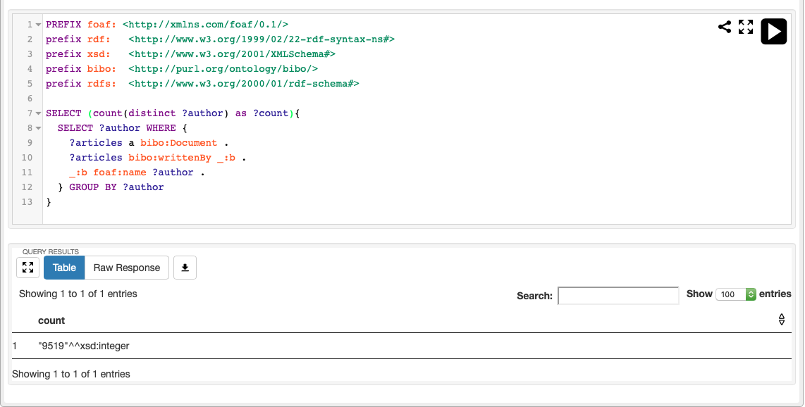

## Scopus Final Project
<hr>

_<strong>Repositorio para el proyecto final del curso Bases de Datos No SQL, de la Universidad del Valle, Cali.</strong>_

## Hecho con

- Fuseki
- Sparql
- Nodejs

<hr>

## Instalación

Construye la imagen

```
docker build -t scopus-image .
```

Corre un contenedor a partir de la imagen creada

```
docker run -d -p 8080:3030 --name scopus-project scopus-image
```

Entra al contenedor

```
docker exec -it scopus-project /bin/sh -c "[ -e /bin/bash ] && /bin/bash || /bin/sh"
```

Y carga el dataset

```
sh load.sh ${FUSEKI_DATASET} triples.ttl
```

## ¿Cómo usarlo?

Entra a Fuseki en http://localhost:8080. Al ingresar, le solicitará usuario y contraseña, para los cuales ingresará "admin" y "123" respectivamente. Ya en Fuseki, vaya a "Manage datasets", haga clic en "Add new dataset", marque "Persistent" y proporcione el nombre de la base de datos exactamente como se proporciona a load.sh, en nuestro caso seria la variable ${FUSEKI_DATASET} que es igual a "scopus"

Ahora vaya a Dataset, seleccione el menú desplegable y pruebe "Info and Query".

Pruebe el query que se encuentra en la carpeta /app/query.rq

```sql
PREFIX foaf: <http://xmlns.com/foaf/0.1/>
PREFIX rdf:   <http://www.w3.org/1999/02/22-rdf-syntax-ns#> 
PREFIX xsd:   <http://www.w3.org/2001/XMLSchema#> 
PREFIX bibo:  <http://purl.org/ontology/bibo/> 
PREFIX rdfs:  <http://www.w3.org/2000/01/rdf-schema#> 

SELECT (count(distinct ?author) as ?count){
  SELECT ?author WHERE { 
    ?articles a bibo:Document .
    ?articles bibo:writtenBy _:b.
    _:b foaf:name ?author .
  } GROUP BY ?author
}
```
El resultado de esta consulta sería el número total de autores sin repetirse y se debe mostrar de esta manera:



Para un total de 9519 autores diferentes en nuestra base de datos.

<hr>


## Desarrollado por:
- Andrés Felipe Suárez V.
- Johan Sebastián Hernández V.